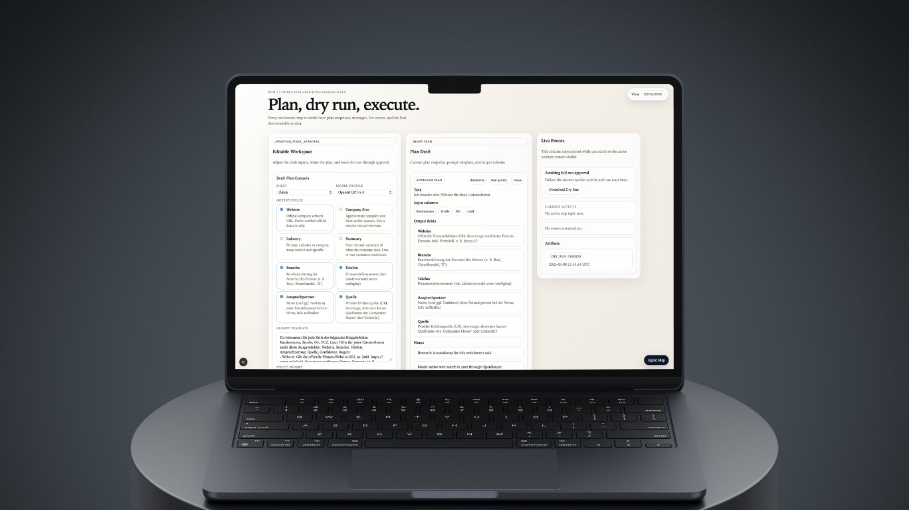

# Enhancer

Enhancer is a spreadsheet research app that turns a messy manual workflow into a guided AI run.

You upload a spreadsheet, describe what you want in plain language, review the plan, test it on sample rows, run it on the full file, and download an enriched workbook with logs and traceable results.





## What It Does

Enhancer helps with spreadsheet tasks that usually take hours of repetitive research.

Examples:

- Find a company's official website
- Add industry, size, or short company summaries
- Classify rows into categories
- Normalize messy table data
- Run repeatable research-heavy enrichment on every row

Instead of using a single prompt and hoping for the best, Enhancer breaks the job into visible steps.

## How It Works

The product flow is designed to stay understandable for the user:

1. Upload an `xlsx`, `xls`, or `csv` file.
2. Enhancer reads the workbook and detects sheets, columns, and preview rows.
3. You describe the job in simple words.
4. The planner creates a draft plan with output fields, prompts, and execution settings.
5. You review or adjust the plan.
6. Enhancer runs a dry run on sample rows first.
7. You approve the result and start the full run.
8. The system processes the whole sheet, exports a new workbook, and keeps an event trail of what happened.

## Why This Project Is Different

This is not built like a generic chatbot.

Enhancer is a research-first spreadsheet workflow with:

- visible planning instead of hidden prompting
- dry runs before full execution
- row-by-row outputs
- live event updates
- downloadable result files
- an audit trail for what the system did

## What The User Sees

The web app currently includes:

- file upload with sheet detection and preview rows
- a planning step that turns the request into a structured run
- plan editing and approval
- dry run review
- live run events and progress updates
- final workbook download
- settings for OpenRouter access and default model profile
- two interfaces on the same backend:
  `Developer View` for technical detail and `User View` for a simpler guided flow

## High-Level Architecture

Enhancer is a monorepo with three main parts:

```text
Enhancer/
├── apps/
│   ├── api/                  # FastAPI backend
│   └── web/                  # Next.js frontend
├── packages/
│   └── enhancer-sdk/         # Python SDK for sandboxed/generated code
├── docs/                     # Product and maintenance docs
├── scripts/                  # Local dev helpers
├── var/                      # Local database, logs, and artifacts during development
├── spec.md                   # Product specification
└── start-enhancer.command    # Mac launcher for local development
```

### `apps/web`

The frontend is a Next.js app where users:

- upload files
- create runs
- review plans
- inspect dry runs
- watch live events
- download results
- manage model settings

### `apps/api`

The backend is a FastAPI service that:

- stores uploaded files and run state
- profiles workbook sheets
- builds plans from user tasks
- runs dry runs and full runs
- validates row outputs
- exports the final workbook
- streams run events back to the UI

### `packages/enhancer-sdk`

This package is the internal Python SDK for advanced or sandboxed execution paths. It gives generated code a controlled way to work with workbooks, logging, artifacts, research, and validation.

## Internal Flow In Simple Words

Under the hood, a run moves through a clear pipeline:

1. `WorkbookService` reads the uploaded file and profiles the selected sheet.
2. `PlanningService` turns the user request into a structured plan.
3. `ExecutionService` starts a dry run on sample rows.
4. `ResearchService` asks the model for structured, cited row outputs.
5. `ValidationService` checks quality and decides whether a retry is needed.
6. `ExportService` writes the enriched workbook for download.
7. `EventService` records the timeline so the UI can show progress live.

## Main Features

- Research-first row enrichment
- Structured output fields instead of loose text blobs
- Dry run before full execution
- Live event stream during processing
- Final workbook export
- Output validation and retry handling
- Model profile selection
- Workspace-level OpenRouter settings
- Simple user mode and advanced developer mode

## Tech Stack

- Frontend: Next.js 15, React 19, TanStack Query
- Backend: FastAPI, SQLAlchemy, Pandas
- Storage: local SQLite by default
- Model access: OpenRouter
- Testing: Vitest for web, Pytest for API

## Local Development

### 1. Install dependencies

Backend:

```bash
python3 -m venv .venv
source .venv/bin/activate
pip install -e packages/enhancer-sdk -e "apps/api[dev]"
```

Frontend:

```bash
npm install
```

### 2. Start the app

Fastest option on macOS:

```bash
./start-enhancer.command
```

Or start both parts manually:

Backend:

```bash
source .venv/bin/activate
uvicorn app.main:app --reload --app-dir apps/api
```

Frontend:

```bash
npm run dev:web
```

App URL:

- Web UI: `http://localhost:3000`
- API: `http://localhost:8000`
- Health check: `http://localhost:8000/health`

## Environment And Configuration

Important backend settings:

- `ENHANCER_DATABASE_URL`
- `ENHANCER_REDIS_URL`
- `ENHANCER_OPENROUTER_API_KEY`
- `ENHANCER_ENCRYPTION_SECRET`
- `ENHANCER_STORAGE_ROOT`
- `ENHANCER_ENABLE_ADVANCED_SANDBOX`

Frontend setting:

- `NEXT_PUBLIC_API_BASE_URL`

Notes:

- By default, local development uses SQLite at `var/enhancer.db`.
- Local artifacts are stored under `var/artifacts`.
- You can also add the OpenRouter key through the app settings screen.

## Testing

Web tests:

```bash
npm run test:web
```

API tests:

```bash
source .venv/bin/activate
pytest apps/api/tests
```

## Repository Guide

If you are browsing the codebase for the first time, these are the best starting points:

- `spec.md` for the product vision
- `apps/web/components/file-intake.tsx` for the upload and run creation flow
- `apps/web/components/run-workspace.tsx` for the main run experience
- `apps/api/app/domain/planning/service.py` for plan generation
- `apps/api/app/domain/execution/service.py` for dry run and full execution
- `apps/api/app/domain/research/service.py` for structured row research
- `docs/agent-architecture.md` for the in-app agent map contract

## Current Direction

Enhancer is aiming to feel like a focused "mini Codex for spreadsheets":

- structured instead of vague
- reviewable instead of opaque
- research-driven instead of guess-driven
- useful for real spreadsheet work, not just demos
